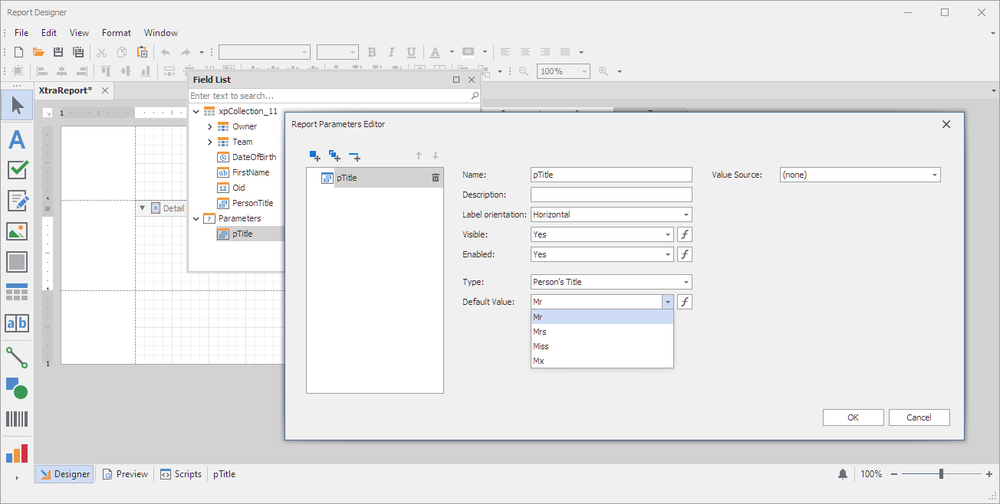

<!-- default badges list -->

<!-- default badges end -->
# Reporting for WinForms - How to Serialize Custom Type Parameters

This example shows how to enable a report parameter of a custom [System.Enum](https://learn.microsoft.com/en-us/dotnet/api/system.enum) type and serialize that parameter so that it can be stored in the report layout file (REPX).

The code does the following:

1. Creates a custom class inherited from the [ReportDesignExtension](https://docs.devexpress.com/XtraReports/DevExpress.XtraReports.Extensions.ReportDesignExtension) class.
2. Overrides the [ReportDesignExtension.AddParameterTypes](https://docs.devexpress.com/XtraReports/DevExpress.XtraReports.Extensions.ReportDesignExtension.AddParameterTypes(System.Collections.Generic.IDictionary-System.Type-System.String-)) method to register a custom parameter type.
3. Registers a custom extension using the [ReportDesignExtension.RegisterExtension](https://docs.devexpress.com/XtraReports/DevExpress.XtraReports.Extensions.ReportDesignExtension.RegisterExtension(DevExpress.XtraReports.Extensions.ReportDesignExtension-System.String)) method.
4. Assigns the report to the created extension using the [ReportDesignExtension.AssociateReportWithExtension](https://docs.devexpress.com/XtraReports/DevExpress.XtraReports.Extensions.ReportDesignExtension.AssociateReportWithExtension(DevExpress.XtraReports.UI.XtraReport-System.String)) method.

## Files to Review

- [Form1.cs](./CS/Form1.cs) (VB: [Form1.vb](./VB/Form1.vb))
- [DataObjects.cs](./CS/DataObjects.cs) (VB: [DataObjects.vb](./VB/DataObjects.vb))

## Documentation

- [Use Report Parameters](https://docs.devexpress.com/XtraReports/4812/detailed-guide-to-devexpress-reporting/use-report-parameters)

## More Examples

- [Custom Report Parameter Types in Web Reporting Controls (ASP.NET Core)](https://github.com/DevExpress-Examples/Reporting-Custom-Parameter-Editor-AspNet-Core)
- [How to use custom report parameter types in web reporting controls](https://github.com/DevExpress-Examples/Reporting-Custom-Parameter-Editor-Mvc)
<!-- feedback -->
## Does this example address your development requirements/objectives?

 

(you will be redirected to DevExpress.com to submit your response)
<!-- feedback end -->
